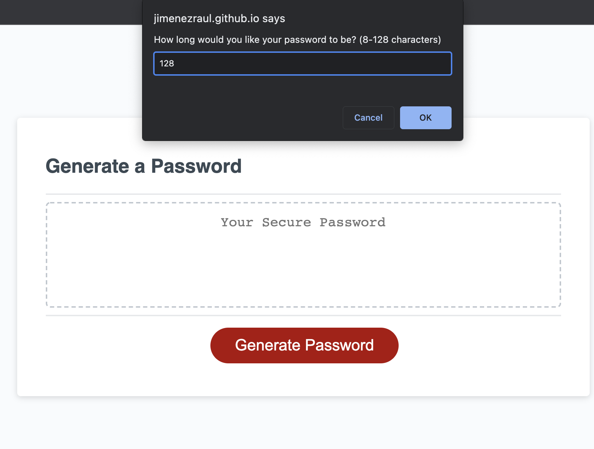
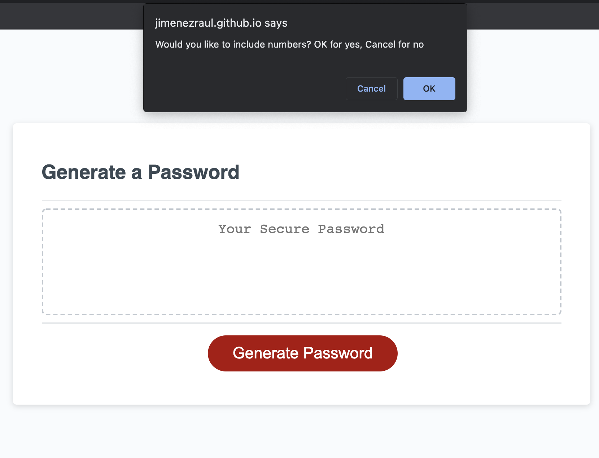
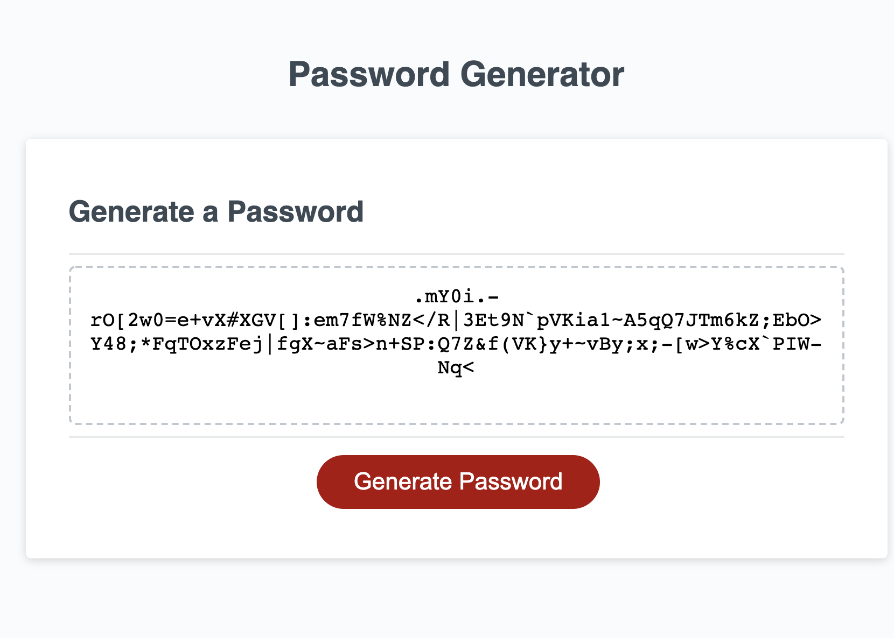
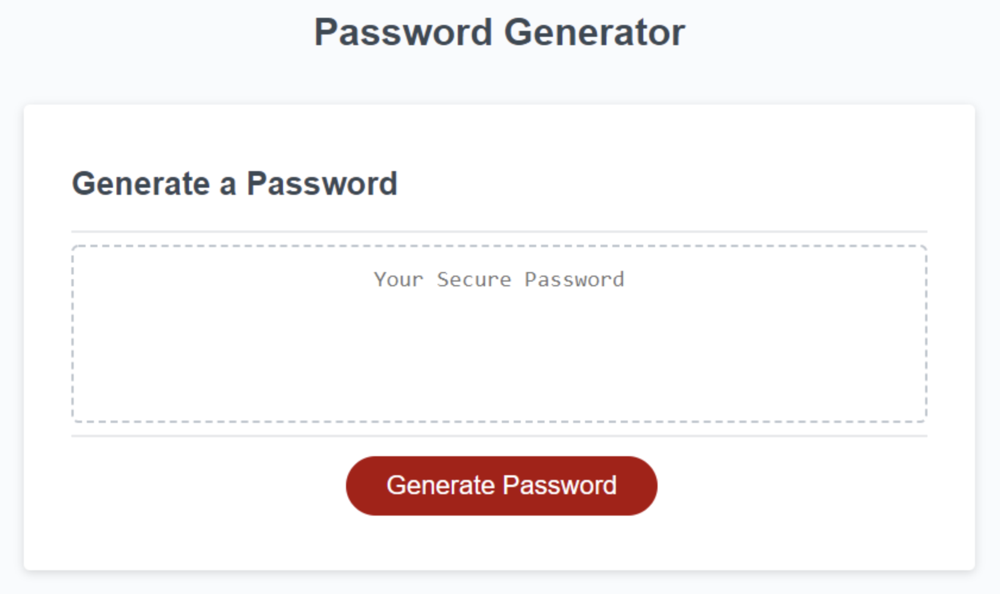

# Password Generator 

## Description
This is a simple password generator that generates a random password based on the user's input.
The user will be presented with a list of characters that they wanted to use in their password.
Users will be able to choose from 8 to 128 characters and choose from 4 different types of characters.
After the user has chosen their characters, the program will generate a random password based on the user's input.

## Types of characters:
- Lowercase letters
- Uppercase letters
- Numbers
- Special characters

## Screenshots

## Mockup

## Deployment

* Deployed Application: &nbsp; [Live URL](https://jimenezraul.github.io/password-generator/)